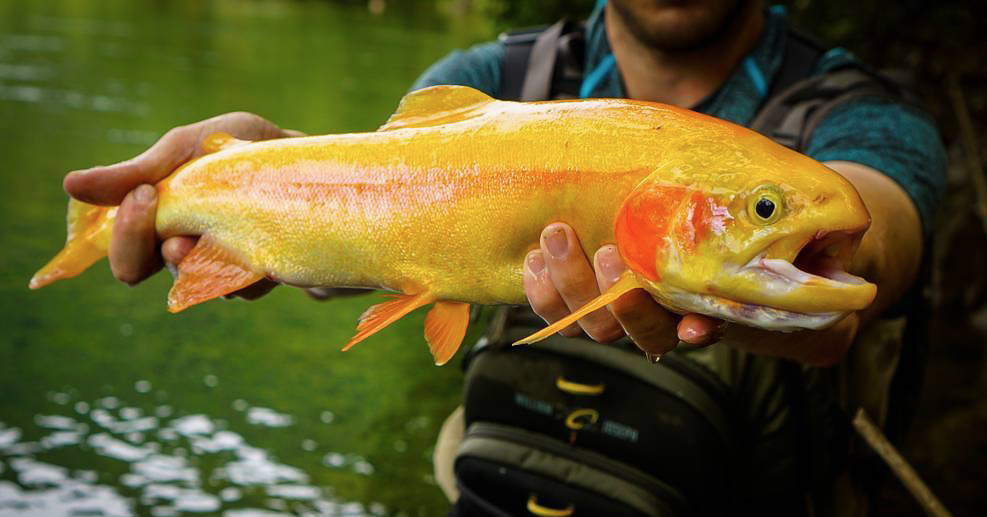
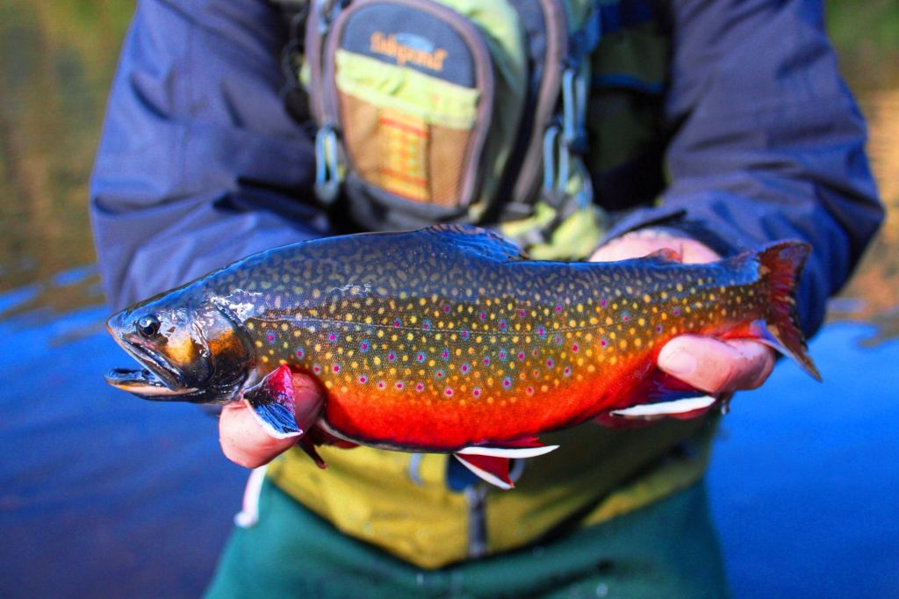

# **How to Catch a Fish**

## Preface:
While catching a fish involves luck, there are certain methods that can increase the chance of success. Since the type of fish and body of water vary greatly depending on geographic location, this guide will focus on spin fishing in the state of **Pennsylvania**.

---

---
## **Required Gear:**
- Fishing rod
- Fishing reel
- Fishing line
- Fishing tackle
- Nail clippers (or other cutting tool)
- Fishing license

## Optional Gear:
- Fish landing net
- Hemostats
- Tackle box/bag
- Bobber
- Sinker weights
- Pliers

---
## **Steps**

### 1. Prepare and organize your gear
- Visit a local tackle shop to purchase gear and receive advice
- Spool the fishing line onto your reel 
    - Tackle shops can do this for you
- Pack tackle based on the body of water and species of fish you are targeting
- Dress appropriately

### 2. Locate a body of water that contains fish
- A creek, river, or lake will all work
- Make sure the location is **not on private property**
- Reference the [PA Fish and Boat Commission](https://www.fishandboat.com/Locate/Pages/MapResources.aspx) for research

### 3. Travel to the body of water
- Dusk and dawn are the best times to fish
- Fish from the shore, carefully wade in, or use a boat

### 4. Find a suitable fishing spot
- Most fish tend to prefer shade or hiding within underwater structures
- **CAUTION: ensure you have enough clearance to swing the fishing rod safely**
- Be prepared to switch fishing spots if you are not catching any fish

### 5. Assemble your gear
- Connect all sections of your fishing rod so that the eyes form a straight line
- Place the fishing reel in the rod's cleat facing downward and tighten
- Run the fishing line through all eyes of the rod
- Attach a lure or hook and bait by using a [**clinch knot**](https://www.youtube.com/watch?v=8gz_w9IaV1A)
    - **WARNING: hooks are sharp**

### 6. Cast
- Hold the fishing line to the rod above the reel seating
- Flip the reel's bail open
- Swing the rod backwards and release the line on the forward swing
- Flip the reel's bail closed

### 7. Wait or reel the line in
- If using bait and a bobber: 
    - Let the bait sit and watch the tip of your rod for any unusual movement
- If using a lure:
    - Attempt to emulate the movement of the appropriate insect/fish/vertebrate
- If you do not feel a fish tugging on the line repeat *step 6* otherwise proceed to *step 7*

### 8. Set the hook and reel the fish in
- Pull the rod upwards in one rapid motion to securely hook the fish
- Reel the fish in *as fast as safely possible* to avoid unnecessary stress for the fish
    - If the fish continues to pull out line, tighten your drag or wait for the fish to tire
    - If your rod begins to bend uncontrollably, release some line to reduce the bend

### 9. Land the fish 
- Use a net to scoop up the fish or **wet your hands from the body of water** before touching the fish 
    - **WARNING: fish have sharp fins**
- Quickly and delicately remove the hook from the fish's mouth using hemostats or your hands
    - If the hook has been swallowed, clip the line as close as possible to the hook
- Swiftly release the fish by placing it back in the water

---

---
